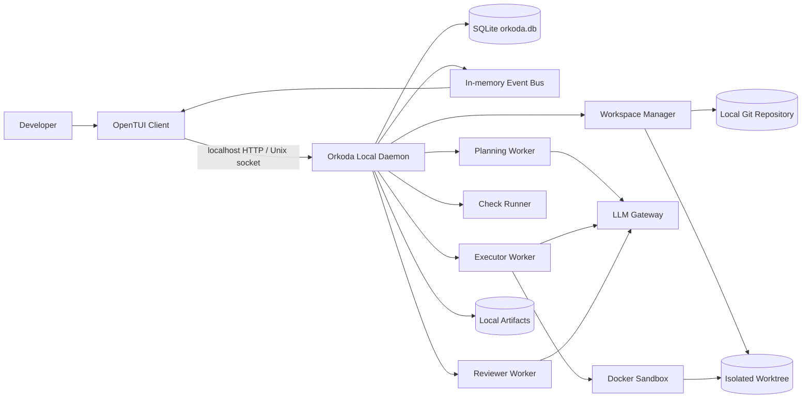
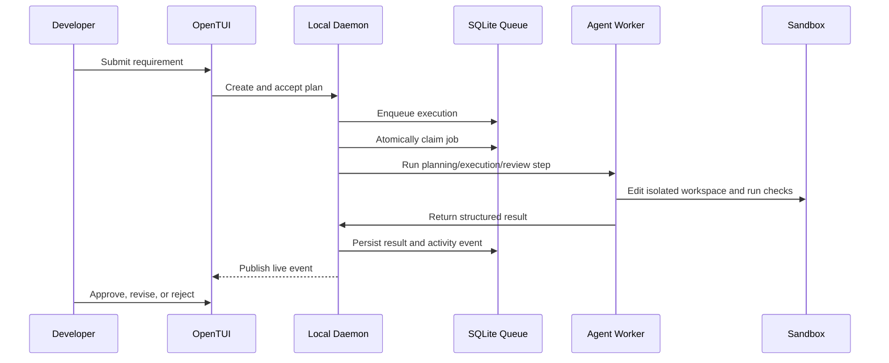

# System Architecture

## 1. Architectural Style

Orkoda adalah aplikasi personal yang berjalan pada satu komputer developer. Arsitektur utama:

- OpenTUI sebagai user interface.
- Satu Golang local daemon untuk API, orchestration, scheduler, dan agent workers.
- SQLite sebagai source of truth dan durable job queue.
- In-memory event bus untuk live update ke TUI.
- Local filesystem untuk artifact dan workspace.
- Isolated Git worktree atau clone untuk setiap job.
- Docker hanya digunakan oleh command sandbox bila fitur tersebut sudah tersedia.

PostgreSQL, Redis, RabbitMQ, MinIO, distributed worker, dan remote control plane berada di luar scope.

## 2. High-Level Diagram



## 3. Single Process Runtime

Satu daemon menjalankan beberapa application component sebagai goroutine:

```text
Orkoda daemon
├── local API
├── workflow state machine
├── SQLite job scheduler
├── planning worker
├── executor worker
├── automated check runner
├── reviewer worker
├── publication worker
└── in-memory event bus
```

Setiap goroutine menerima `context.Context`, berhenti saat daemon shutdown, dan tidak menyimpan business state hanya di memory.

## 4. Persistence

### SQLite

SQLite menyimpan:

- project dan repository registration;
- plan dan acceptance criteria;
- workflow job dan execution version;
- durable background job queue;
- tool run dan automated check result;
- review, revision, dan approval;
- publication record;
- activity timeline dan audit metadata.

Database default berada di `.orkoda/orkoda.db` dengan konfigurasi:

```sql
PRAGMA journal_mode = WAL;
PRAGMA foreign_keys = ON;
PRAGMA busy_timeout = 5000;
PRAGMA synchronous = NORMAL;
```

Daemon menggunakan satu pooled connection. Transaction harus pendek dan tidak boleh mencakup model call, command execution, atau operasi Git.

### Local Filesystem

File besar tidak disimpan sebagai BLOB di SQLite. Folder `.orkoda/` menyimpan:

- `artifacts/`: patch, log, test report, dan debug bundle;
- `workspaces/`: isolated Git workspace;
- `logs/`: log aplikasi lokal.

Artifact write harus atomik dan path harus divalidasi agar tidak keluar dari root storage.

## 5. Durable Job Queue

RabbitMQ diganti dengan tabel SQLite `jobs`. Queue mendukung:

- scheduled execution melalui `run_after`;
- atomic claim menggunakan `UPDATE ... RETURNING`;
- attempt counter dan maximum attempts;
- retry/backoff;
- terminal status `DEAD`;
- stale lock recovery setelah daemon crash;
- idempotency pada application handler.

Queue hanya diproses oleh daemon lokal. Tidak ada distributed consumer atau network broker.

## 6. Event Delivery

Redis Pub/Sub diganti dengan in-memory event bus.

Aturan penting:

1. Event penting ditulis ke `activity_events` terlebih dahulu.
2. Setelah commit, event ringan dipublish ke subscriber TUI.
3. Publish tidak boleh memblokir workflow.
4. Subscriber lambat dapat kehilangan live notification tetapi mengambil ulang timeline dari SQLite.
5. Restart daemon tidak kehilangan durable activity event.

## 7. Cache and Locks

- Cache non-kritis menggunakan process memory dan boleh hilang saat restart.
- Single-instance lock menggunakan OS file lock ketika launcher tersedia.
- Workspace write lease disimpan di SQLite.
- In-process mutual exclusion menggunakan `sync.Mutex` hanya untuk data memory.
- Source repository tidak pernah dijadikan writable workspace.

## 8. Domain Boundaries

- **Project:** project, repository binding, instruction, dan checks.
- **Planning:** requirement, plan version, steps, criteria, dan risk.
- **Workflow:** job, state transition, retry, timeout, dan cancellation.
- **Workspace:** base commit, isolated path, lease, dan patch checkpoint.
- **Execution:** model call, tool run, file changes, dan usage.
- **Checks:** formatter, linter, type check, test, dan build evidence.
- **Review:** issues, criteria result, dan residual risk.
- **Approval:** immutable decision binding.
- **Publication:** local commit, branch push, dan draft pull request.

Tidak ada multi-user identity atau project membership pada MVP personal-local.

## 9. Workflow Flow



## 10. Failure Boundaries

- TUI exit tidak merusak atau membatalkan durable job.
- Daemon restart memulihkan job `RUNNING` yang stale.
- Provider failure tidak merusak workspace.
- Check failure menjadi evidence, bukan kehilangan execution.
- Event bus overflow tidak menghilangkan timeline database.
- Artifact write menggunakan temporary file dan atomic rename.
- Publication dapat diulang secara idempotent dari approval yang sama.

## 11. Future Extension Boundary

NATS, PostgreSQL, distributed workers, remote execution, dan object storage hanya dipertimbangkan bila scope berubah menjadi multi-machine. Mereka tidak disiapkan secara default dan tidak boleh menambah kompleksitas MVP lokal.
