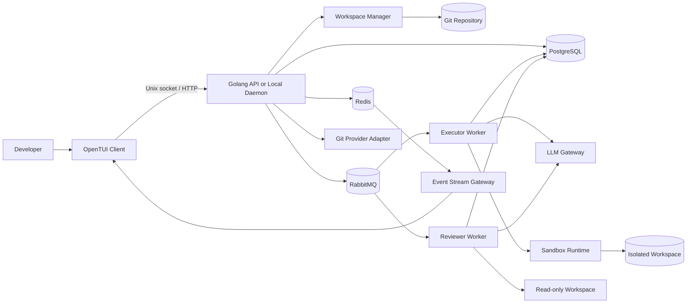
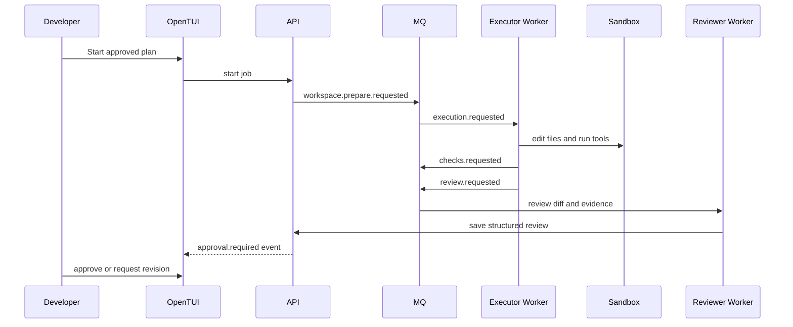

# System Architecture

## 1. Architectural Style

- OpenTUI terminal client sebagai delivery layer.
- Golang hexagonal architecture untuk domain dan application services.
- Event-driven workers untuk pekerjaan asynchronous.
- Isolated Git workspace untuk setiap job.
- Sandboxed tool execution.
- Immutable execution, review, dan approval versions.

## 2. High-Level Diagram



## 3. Komponen

### OpenTUI Client

Tanggung jawab:

- Repository picker dan project dashboard.
- Requirement dan structured plan editor.
- Job progress, tool activity, dan log viewer.
- Changed-file tree dan diff viewer.
- Check result dan review issue panel.
- Approval, revision, rejection, commit, dan pull request actions.
- Local configuration, key bindings, theme, dan diagnostics.

TUI tidak menjadi sumber kebenaran workflow. Semua transition divalidasi backend.

### API / Local Daemon

- Menyediakan protocol untuk TUI.
- Authentication untuk remote mode dan local profile untuk local mode.
- CRUD project, repository, plan, agent, job, dan check configuration.
- Memvalidasi command user.
- Mengelola state transition dan outbox.
- Menyediakan query timeline, diff metadata, review, dan usage.

### Workflow Orchestrator

- Memvalidasi current state dan aggregate version.
- Menentukan tahap berikutnya.
- Membuat execution, check, review, approval, dan publication records.
- Menangani revision loop, budget, timeout, cancellation, dan policy override.

### Repository Manager

- Memvalidasi repository Git.
- Membaca remote, branch, commit, dirty state, submodule, dan ignore rules.
- Menjaga repository sumber tetap tidak berubah.
- Menyediakan adapter untuk repository lokal dan Git provider remote.

### Workspace Manager

- Membuat Git worktree atau isolated clone.
- Mengikat workspace ke `base_commit_sha`.
- Mengatur lock, quota, cleanup, archive, dan recovery.
- Menyimpan patch checkpoint untuk rekonstruksi.

### Executor Worker

- Mengonsumsi `execution.requested`.
- Menyiapkan context repository.
- Memanggil LLM dan menjalankan tool loop.
- Menulis file hanya dalam workspace.
- Menyimpan tool run, patch, summary, usage, dan status.
- Memicu automated checks setelah execution selesai.

### Check Runner

- Menjalankan formatter, linter, type check, test, build, dan custom checks.
- Menggunakan sandbox dan environment policy yang sama.
- Menyimpan output ringkas dan log artifact.

### Reviewer Worker

- Mengonsumsi `review.requested`.
- Membaca plan, base commit, final diff, tool summary, dan check results.
- Menggunakan workspace read-only.
- Menghasilkan structured review dan blocking policy result.

### LLM Gateway

```go
type Provider interface {
    Generate(ctx context.Context, req GenerateRequest) (GenerateResponse, error)
    Stream(ctx context.Context, req GenerateRequest) (<-chan StreamEvent, error)
}
```

Tanggung jawab:

- Provider routing dan fallback policy.
- Timeout dan cancellation.
- Usage normalization dan cost estimation.
- Structured response validation.
- Prompt redaction dan request audit metadata.

### Sandbox Runtime

- Container atau microVM adapter.
- CPU, memory, process, disk, dan wall-clock limit.
- Workspace mount dengan path yang eksplisit.
- Network disabled secara default.
- Environment allowlist dan secret broker.
- Output size limit dan process tree termination.

### PostgreSQL

Sumber kebenaran untuk project, repository, plan, job, workspace, execution, tool run, check, review, approval, publication, outbox, dan audit.

### Redis

- Distributed lock singkat.
- Rate limit.
- Event fan-out ke TUI.
- Worker heartbeat.
- Cache non-kritis.

### RabbitMQ

Durable commands:

- `workspace.prepare.requested`.
- `execution.requested`.
- `checks.requested`.
- `review.requested`.
- `publication.requested`.

### Artifact Storage

- Patch dan diff besar.
- Command log.
- Test report.
- Coverage report.
- Workspace archive bila policy mengizinkan.

## 4. Domain Boundaries

- **Identity:** user, profile, token, membership.
- **Project:** project, repository binding, project instruction, check configuration.
- **Planning:** requirement, plan version, steps, criteria, risk.
- **Workflow:** job, stage, transition, budget, cancellation.
- **Workspace:** base commit, path, state, lock, patch checkpoint.
- **Execution:** execution version, model call, tool run, file change summary.
- **Checks:** check definition, run, result, evidence.
- **Review:** review, issue, criteria result, residual risk.
- **Approval:** decision, override, immutable binding.
- **Publication:** commit, branch push, pull request.

## 5. Command and Event Flow



## 6. Transactional Outbox

State change dan event creation terjadi dalam satu database transaction. Publisher mengirim event dari `outbox_events`; consumer menyimpan `message_id` di `processed_messages`.

## 7. Concurrency and Idempotency

- `jobs.version` menggunakan optimistic locking.
- Satu active execution per job.
- Satu publication per approved execution dan target.
- Workspace memiliki exclusive write lease.
- Duplicate delivery tidak menjalankan tool atau Git push dua kali.

## 8. Event Streaming to TUI

Worker menulis event permanen ke database dan publish event ringan ke Redis. TUI berlangganan melalui Unix socket stream pada local mode atau HTTP event stream pada remote mode. Reconnect menggunakan sequence terakhir dan mengambil event yang terlewat dari database.

## 9. Scaling

- TUI selalu berjalan di sisi developer.
- API stateless kecuali local daemon mode.
- Executor, check, dan Reviewer workers diskalakan terpisah.
- Workspace ditempatkan pada worker pool yang memiliki storage sesuai policy.
- Provider rate limit dikelola terpusat.

## 10. Failure Boundaries

- TUI berhenti tidak membatalkan job kecuali user mengirim cancel.
- Provider gagal tidak merusak workspace.
- Check gagal menghasilkan evidence, bukan kehilangan execution.
- Reviewer gagal tidak menghapus diff.
- Event stream gagal tidak menghilangkan timeline.
- Publication gagal dapat di-retry secara idempotent.
